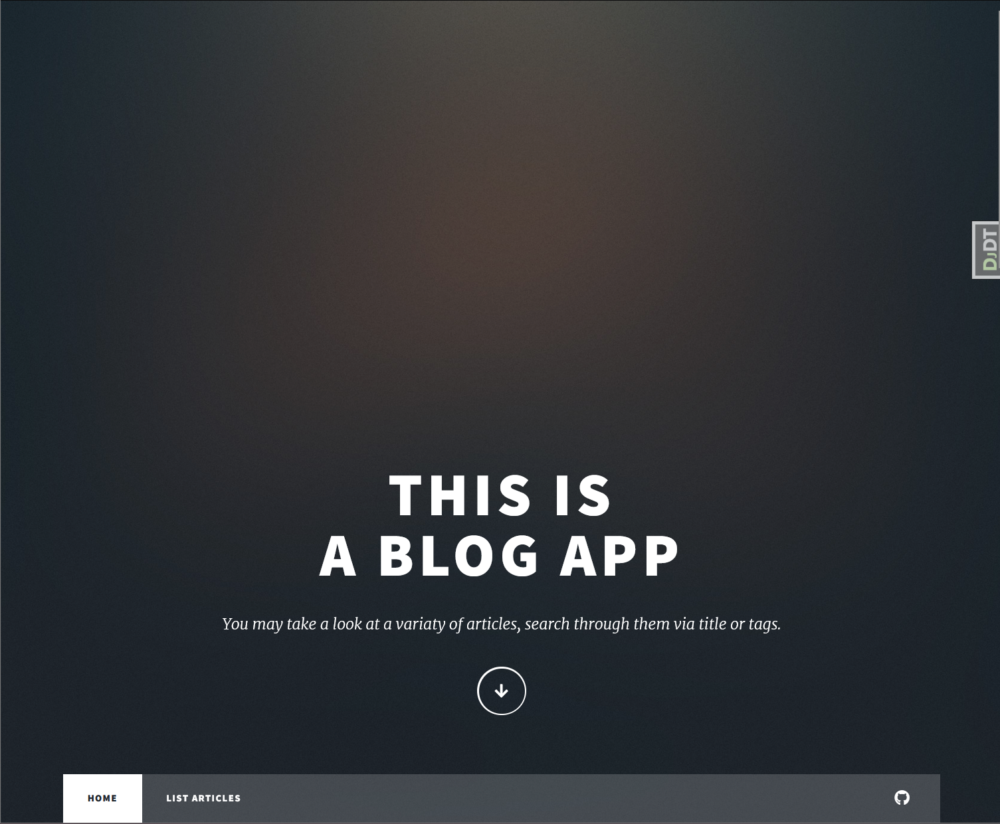

# Blogovací aplikace
Aplikace vytvořena podle zadání. Tato aplikace se skládá z následujícího:
* 3 statických webových stránek
    * homepage: možnost fulltextového vyhledávání i filtrace podle tagů a následného výběru článku
    * list: možnost vylistování všech článků s podporou paginace
    * detail: individuální detail článků pro zobrazení veškerých informací
* 1 admin stránky: pro možnost vytváření/upravování/smazání článku nebo tagu
* grafické zpracování pomocí HTML templatu: [[aj@lkn.io | @ajlkn]](https://html5up.net/massively)
* analýzy projektu: [link](#analýza-projektu)
* možnosti snadného rozjetí ([link](#jak-rozjet)) pomocí:
    * docker-compose souboru
    * základních fixtures
* možnosti testování:
    * unit-testy
    * testovací CI/CD pro [[github]](https://github.com/Hanisekkus/blog-app)

## Rozcestník
1) [Úvod](#blogovací-aplikace)
2) [Analýza projektu](#analýza-projektu)
3) [Jak rozjet](#jak-rozjet)
    * [Prerekvizity](#prerekvizity)
    * [1. krok](#1-krok-stáhnout-projekt)
    * [2. krok](#2-krok-spusťte-docker-compose)
    * [3. krok](#3-krok-ověření)
    * [4. krok](#4-krok-příhlášení-se-k-admin-stránkám)


## Analýza projektu

### Je to aplikace či projekt?
Z pohledu zadání je možné vyvíjet jak projekt, tak aplikaci. Každopádně blogovací aplikace byla vyvinuta jako aplikace, díky možnosti modularity a následnému znova použití v jiných projektech.

Ačkoli aplikace byla vyvinuta v jako Django aplikace, nebylo aplikována možnost vytvoření Pypi balíčku, přišlo mi to nad rámec zadání.

### Databáze?
V základu Django vytváří SQLite databázi, která je skvělá pro mnoho případů použití. Každopádně, po projetí požadavků jsem si zvolil databázi Postgresql z nekolika důvodů.

* Skvělá integrace s Djangem pomocí contrib aplikace.

* V tomto případě sice ne tak důležité, ale snazší škalovatelnost atd.

* Hlavní bod v mém případě je možnost využít fulltextového hledání. Jeden z požadavků je možnost vyhledávat v databázi podle vstupu uživatele a podle mě je fulltextové hledání přesně to co se k tomu hodí.

### Vytváření thumb images?
Jeden z požadavků v zadání je z originálního obrázku vytvořit tzv. `thumbnail` obrázek. Po rozmyšlení jsem se rozhodl daný obrázek vytvářet již při požadavku na vytvoření záznamu v databázi a přidat jej k danému záznamu. Díky tomu má naše aplikace už v databázi daný obrázek uložený a nemusí jej každým požadavkem znova vytvářet.

* Django v základu obrázky nemaže, ani po smazání záznamu v databázi. Je to z důvodů možnosti použití rollbacků a nemožnosti vědět zdali daný obrázek není používán jiným modelem, či systémem. Proto jsem totu chování zanechal. Zadání nijak nespecifikuje co s obrázky v takovém případě dělat.

* Otázka ukládání obrázků viz. [úložiště?](#úložiště)

### Cachování?
Jelikož se jedná o webovou aplikaci, která má potenciál zobrazovat málo se měnící se obsah, je vhodné v tuto chvíli zvolit možnost Cachování, aby se nedrtila databáze pro dotazy, které už byly vyřešeny dříve.

Pro Cachování byla zvolena technologie [[Redis]](https://redis.io/)

### Logování?
Pro produkční režim je vhodné, aby se celé chování naší webové aplikace někam zapisovalo. Kdy v případě potřeby je možné zpětně se podívat na logy a vyčíst z nich důležité informace. 

Proto bych zvolil technologii [[Kibanu]](https://www.elastic.co/kibana)
* *Každopádně Kibanu jsem nepřidával jelikož pro testovací aplikaci by to bylo nad rámec a nepřineslo by to žádné výhody (nehodlám danou testovací aplikaci nikam nasazovat)*

### Úložiště?
Momentálně se obrázky ukládají na File System aplikace, kde běží. Pro testovaní je to nejspíš v pořádku, každopádně pro produkční využití by mělo být vytvořeno nějaké externí úložiště jako je [[S3]](https://aws.amazon.com/s3/) pro ukládání těchto dat.

### Security?
1) Aplikační: Naše aplikace vyžaduje od uživatele vstupy.
    * Při hledání chceme aby uživatel zadával query, podle kterého se budou listovat články. Tento vstup ale může být nebezpečený a proto je nutné jej správně ošetřit.
2) Architekturová:
    * Databáze: Momentálně je databáze nastavena na velice triviální zabezpečení v souboru setting.py je výpis všech přihlašovacích údajů. Každopádně v provozním režimu by tyto informace měli se k aplikaci dostat úplně jiným způsobem ať už přes konfigurační soubor, nebo ENV, které aplikaci provozní prostředí poskytne.
    * Redis: Redis momentálně funguje bez žádného zabezpečení (vhodné pouze pro vývoj). Opět jako u databáze, toto není vhodný přístup pro produkční režim.

## Jak rozjet
V této sekci je sepsáno jak daný projekt rozjet.

### Prerekvizity
Pro možnost spuštení projektu je nutné mít nainstalovaný [[Docker]](https://www.docker.com/)


### [1. krok] Stáhnout projekt
Spusťte si terminal a zadejte:
```bash
git clone https://github.com/Hanisekkus/blog-app.git
```

### [2. krok] Spusťte docker-compose
Následně se přesuňte do složky s projektem
```bash
cd blog-app
```

a spusťte docker-compose
```bash
docker-compose up
```

### [3. krok] Ověření
Momentálně by vám měla aplikace již běžet, pro ověření si otevřete váš prohlížeč a zadejte tuto URL adresu: `http://127.168.0.1:8000/blog/` a měla by se vám zobrazit následující stránka



### [4. krok] Příhlášení se k admin stránkám
Defaultně byly extrahovány fixtures již existujícího `superusera` aby nebylo nutné jej vytvářet.

Jeho uživatelské údaje jsou:
```
username: admin
password: admin
```

Url admin stránek je tato: `http://127.168.0.1:8000/admin`
